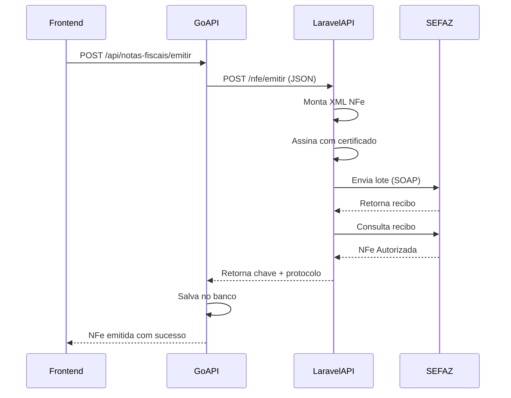

# 🚀 API Laravel NFe - Integração sped-nfe

API secundária em Laravel/PHP para emissão de Notas Fiscais Eletrônicas usando a biblioteca **sped-nfe** (madura e testada pela comunidade brasileira).

## 📋 Visão Geral

Esta API foi criada para resolver problemas de emissão de NFe, fornecendo uma solução robusta e confiável usando a biblioteca PHP mais utilizada no Brasil para NFe.

### Arquitetura

```
┌─────────────────┐      HTTP REST       ┌──────────────────┐
│   API Go        │ ────────────────────> │  API Laravel     │
│  (Principal)    │   JSON + Token Auth   │  (NFe)           │
│                 │ <──────────────────── │                  │
└─────────────────┘                       └──────────────────┘
                                                   │
                                                   │ SOAP/XML
                                                   ↓
                                          ┌──────────────────┐
                                          │   SEFAZ          │
                                          │   (Governo)      │
                                          └──────────────────┘
```

## 🛠️ Stack Tecnológica

- **Laravel 10** - Framework PHP
- **PHP 8.2** - Com extensões soap, openssl, curl, dom, zip
- **sped-nfe 5.x** - Biblioteca oficial para NFe
- **sped-da 5.x** - Geração de DANFE (PDF)
- **Docker** - Container isolado

## 📦 Estrutura do Projeto

```
livefy-nfe-api/
├── app/
│   ├── Http/
│   │   ├── Controllers/
│   │   │   ├── NFeController.php      # Endpoints REST
│   │   │   └── HealthController.php   # Health check
│   │   └── Middleware/
│   │       └── ApiTokenMiddleware.php # Autenticação
│   └── Services/
│       └── NFeService.php              # Lógica sped-nfe
├── config/
│   ├── cors.php                        # CORS config
│   └── nfe.php                         # Config NFe
├── routes/
│   └── api.php                         # Rotas da API
├── composer.json                       # Dependências PHP
├── Dockerfile                          # Container config
└── .env.example                        # Variáveis de ambiente
```

## 🚀 Instalação e Configuração

### 1. Preparar Ambiente

```bash
cd /home/galvao/Desktop/Freelas/uselivefy/livefy-nfe-api

# Copiar .env
cp .env.example .env

# Editar .env e configurar:
# - APP_KEY (será gerado)
# - API_SECRET_TOKEN (token compartilhado com Go API)
# - NFE_AMBIENTE (1=Produção, 2=Homologação)
```

### 2. Instalar Dependências

```bash
# Dentro do container ou localmente
composer install
php artisan key:generate
```

### 3. Subir com Docker

```bash
# Na raiz do projeto
docker-compose -f docker-compose.dev.yml up nfe-api --build
```

A API estará disponível em: **http://localhost:8001**

### 4. Testar Health Check

```bash
curl http://localhost:8001/api/health
```

Resposta esperada:
```json
{
  "status": "ok",
  "service": "Livefy NFe API",
  "version": "1.0.0",
  "extensions": {
    "soap": true,
    "openssl": true,
    "curl": true,
    "dom": true,
    "zip": true
  }
}
```

## 🔐 Autenticação

Todas as rotas (exceto `/health`) requerem o header:

```http
X-API-Token: livefy_nfe_secret_token_change_me_in_production
```

**IMPORTANTE:** Configure o mesmo token em ambas as APIs:
- Laravel: `API_SECRET_TOKEN` em `.env`
- Go: `LARAVEL_NFE_API_TOKEN` em variável de ambiente

## 📡 Endpoints da API

### 1. Emitir NFe

**POST** `/api/nfe/emitir`

```json
{
  "dados_fiscais": {
    "cnpj": "12345678000190",
    "razao_social": "EMPRESA LTDA",
    "nome_fantasia": "Empresa",
    "inscricao_estadual": "123456789",
    "regime_tributario": 1,
    "uf": "SP",
    "cep": "01310100",
    "logradouro": "Av Paulista",
    "numero": "1000",
    "bairro": "Bela Vista",
    "cidade": "São Paulo",
    "codigo_municipio": "3550308",
    "email": "contato@empresa.com",
    "telefone": "1112345678",
    "certificado_base64": "MIIE...",
    "certificado_senha": "senha123"
  },
  "nota": {
    "numero": 1,
    "serie": "1",
    "natureza": "Venda de mercadoria",
    "cfop": "5102",
    "valor_total": 100.00
  },
  "cliente": {
    "nome": "Cliente Teste",
    "documento": "12345678901",
    "email": "cliente@email.com",
    "endereco": {
      "logradouro": "Rua X",
      "numero": "100",
      "bairro": "Centro",
      "cidade": "São Paulo",
      "uf": "SP",
      "cep": "01000000",
      "codigo_municipio": "3550308"
    }
  },
  "itens": [
    {
      "codigo": "PROD001",
      "nome": "Produto Teste",
      "quantidade": 1,
      "valor_unitario": 100.00,
      "valor_total": 100.00,
      "ncm": "12345678",
      "cfop": "5102",
      "unidade": "UN"
    }
  ]
}
```

**Resposta de Sucesso:**
```json
{
  "success": true,
  "data": {
    "chave": "35230512345678000190550010000000011234567890",
    "protocolo": "135230000000001",
    "data_autorizacao": "2026-01-28T10:30:00-03:00",
    "xml": "PD94bW...base64...",
    "status": "autorizada",
    "mensagem": "Autorizado o uso da NF-e"
  }
}
```

### 2. Consultar NFe

**POST** `/api/nfe/consultar`

```json
{
  "chave": "35230512345678000190550010000000011234567890",
  "dados_fiscais": {
    "cnpj": "12345678000190",
    "uf": "SP",
    "certificado_base64": "MIIE...",
    "certificado_senha": "senha123"
  }
}
```

### 3. Cancelar NFe

**POST** `/api/nfe/cancelar`

```json
{
  "chave": "35230512345678000190550010000000011234567890",
  "protocolo": "135230000000001",
  "motivo": "Cancelamento por erro de digitação",
  "dados_fiscais": {
    "cnpj": "12345678000190",
    "uf": "SP",
    "certificado_base64": "MIIE...",
    "certificado_senha": "senha123"
  }
}
```

### 4. Validar Certificado

**POST** `/api/certificado/validar`

```json
{
  "certificado_base64": "MIIE...",
  "senha": "senha123"
}
```

**Resposta:**
```json
{
  "success": true,
  "data": {
    "valido": true,
    "nome": "EMPRESA LTDA:12345678000190",
    "cnpj": "12345678000190",
    "validade_inicio": "2024-01-01",
    "validade_fim": "2025-12-31",
    "dias_restantes": 337
  }
}
```

## 🔧 Configuração na API Go

### 1. Adicionar Variáveis de Ambiente

Edite `docker-compose.dev.yml` ou `.env` da API Go:

```yaml
environment:
  LARAVEL_NFE_API_URL: http://nfe-api:9000/api
  LARAVEL_NFE_API_TOKEN: livefy_nfe_secret_token_change_me_in_production
```

### 2. Atualizar Handler de Nota Fiscal

O código em [handlers/nota_fiscal.go](../livefy-api/handlers/nota_fiscal.go) já foi atualizado para usar a API Laravel quando `provedor_nfe = "sefaz"`.

### 3. Testar Integração

```bash
# 1. Subir ambas as APIs
docker-compose -f docker-compose.dev.yml up mysql api nfe-api --build

# 2. Configurar dados fiscais com provedor "sefaz"
# 3. Tentar emitir uma NFe
```

## 🐛 Troubleshooting

### Erro: "Unauthorized - Invalid API Token"

- Verifique se o token está configurado corretamente em ambas as APIs
- Certifique-se de enviar o header `X-API-Token`

### Erro: "Certificado inválido"

- Verifique se o certificado está em formato PFX/PKCS12 válido
- Teste com o endpoint `/api/certificado/validar`
- Senha do certificado pode estar incorreta

### Erro: "SOAP-ERROR: Parsing WSDL"

- Problema de conectividade com SEFAZ
- Verifique se o container tem acesso à internet
- Em homologação, alguns webservices podem estar offline temporariamente

### Logs da API Laravel

```bash
# Ver logs em tempo real
docker logs -f livefy-nfe-api

# Logs do Laravel ficam em
tail -f livefy-nfe-api/storage/logs/laravel.log
```

## 📝 Diferenças entre Provedores

| Provedor | Custo | Complexidade | Estabilidade | Suporte |
|----------|-------|--------------|--------------|---------|
| **Focus NFe** | Pago | Baixa | Alta | Sim |
| **SEFAZ (Go)** | Grátis | Alta | Média | Não |
| **SEFAZ (Laravel)** | Grátis | Média | Alta | Comunidade |

**Recomendação:** Use `sefaz` via API Laravel para economizar e ter boa estabilidade.

## 🔄 Fluxo de Emissão



## 🚢 Deploy em Produção

### 1. Configurações Importantes

```env
APP_ENV=production
APP_DEBUG=false
NFE_AMBIENTE=1
API_SECRET_TOKEN=<token_super_seguro_gerado>
```

### 2. Otimizações

```bash
composer install --no-dev --optimize-autoloader
php artisan config:cache
php artisan route:cache
php artisan view:cache
```

### 3. Segurança

- ✅ Use HTTPS em produção
- ✅ Token forte e único por ambiente
- ✅ Limite rate limiting nas rotas
- ✅ Monitore logs de erro
- ✅ Backup dos certificados digitais

## 📚 Recursos Adicionais

- [Documentação sped-nfe](https://github.com/nfephp-org/sped-nfe)
- [Portal NFe SEFAZ](http://www.nfe.fazenda.gov.br/)
- [Schemas NFe](http://www.nfe.fazenda.gov.br/portal/listaConteudo.aspx?tipoConteudo=BMPFMBoln3w=)

## ✅ Checklist de Implantação

- [ ] API Laravel rodando e health check ok
- [ ] Token configurado em ambas as APIs
- [ ] Certificado digital válido carregado
- [ ] Teste em homologação (ambiente 2)
- [ ] NFe emitida com sucesso em homologação
- [ ] Validar XML gerado
- [ ] Configurar ambiente de produção (ambiente 1)
- [ ] Monitoramento de logs ativo

---

**Desenvolvido por:** Livefy Tech Team  
**Data:** Janeiro 2026  
**Versão:** 1.0.0
